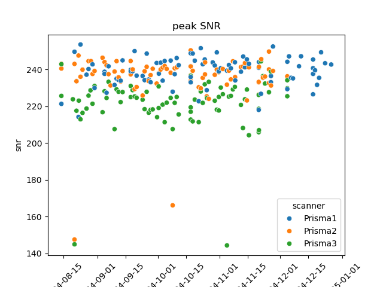

# MRRC Prisma Phantom QC Container (Flywheel)

**Measure signal-to-noise on daily phantom EPIs across scanners.**

{: style="width:200px"}
--> 
{: style="width:200px"}

Matlab SNR phantom code ({{ gitlink("Program/dostat.m") }}) has been [ported to octave](octave-port.md) to run as a podman/docker container.
The container (defined by {{ gitlink("Dockerfile") }}) uses flywheel conventions (`/flywheel/v0` base directory) and doubles as [a flywheel SDK gear](flywheel.md) ({{ gitlink("manifest.json") }} specified [run][Program.run] script).

Additionally, this repository contains [helpers][helpers] that maybe be interesting in that they demonstrate using the flywheel python SDK to

--8<-- "; docs/helpers.md:Overview"
--8<-- "docs/helpers.md:9:13"
     

Finally, code herein also uses

  * the dokuwiki XML-RPC to upload an image (sftp access work around)
  * [`mkdocstrings`](https://mkdocstrings.github.io/) with mkdocs to include python docstrings in this documentation. See {{ gitlink("mkdocs.yml") }} and {{ gitlink("docs/macros.py") }}

