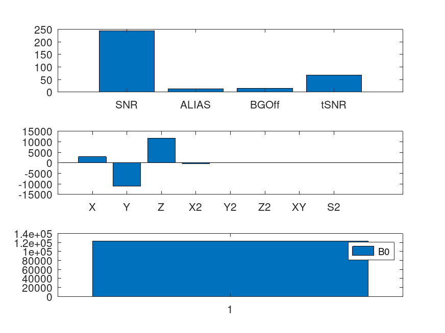
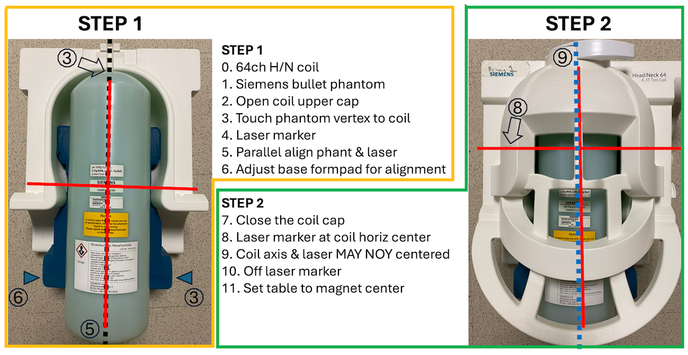
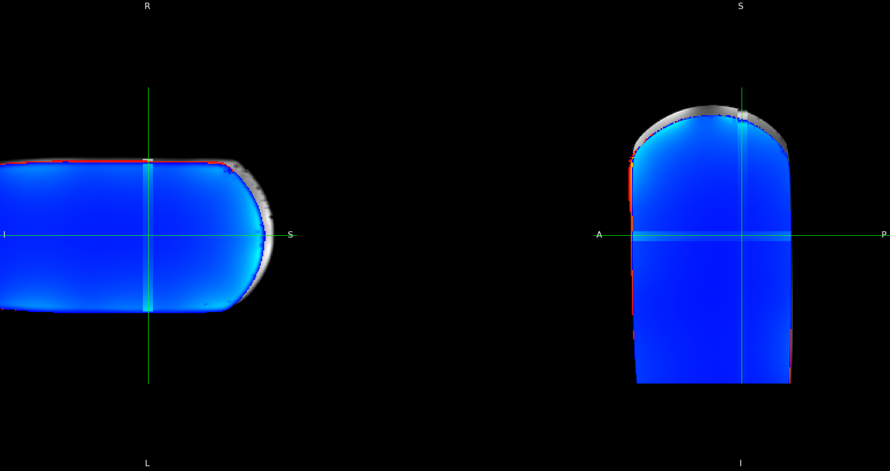

# MRRC Prisma Phantom QC

```shell
Program/QC.m input/QA_PRISMA3QA_20240809_180204_160000/EP2D_BOLD_P2_S2_5MIN_0003/ outputs/

jq .snrpk < outputs/stats.json # 242.8687622000182
ls outputs/bars.png
```




## TODO

  * break up `Program/dostat.m` and add tests using `input/trunc`
    * optimize/vectorize esp. `std` command? surprisingly slow
    * profile against matlab runtime - switch to ML compiled version if octave is much slow
  * slim docker container: build octave without Xorg or java (likely to be useful for other containers later)
  * add subset of stats.json to FW DB
  * create script (outside of flywheel) to plot stats across time

## Testing

```
make test
make test-docker
```

Using octave `%!test` in-file tests. See bottom of [Program/readshimvalues.m](Program/readshimvalues.m).

## Editiing

 * `Makefile` guides through steps 
   * see `.docker` then `.gear` for packaging
   * mess of other files for `.gear-run.txt` with various input files setup (download input zip and setup `config.json`)
      * [`fw-beta`](https://flywheel-io.gitlab.io/tools/app/cli/fw-beta/) is used for gear setup
      * this started from [hello-world gear](https://gitlab.com/flywheel-io/scientific-solutions/tutorials/Gear-Building-Tutorial/-/tree/hello-world)
      * `Program/run.py` still used for flywheel entry (sets up `input/` and `output`, eventually handles DB)

 * bump version in [`manifest.json`](manifest.json): `"version":` and `"custom": { "gear-builder": { "image": "npac/mrrcqa:1.0.20240822" } }`  current match.


### Noteworth files

|file|desc|
|--|--|
|[`Program/QC.m`](Program/QC.m) | octave script, docker entrypoint into `@chm`s matlab QC code|
|[`Program/run.py`](Program/run.py) | flywheel-aware entrypoint for gear. unzips and dispatches to QC.m |
|[`Makefile`](Makefile) | `make` interface to building and testing recipes |
|[`Dockerfile`](Dockerfile) | describes software dependencies, recipe for container |
|[`config.json`](config.json) | `fw-beta gear run` input. built with Makefile |

## Interfacing with Flywheel
 * repo init with copy from https://gitlab.com/flywheel-io/scientific-solutions/tutorials/Gear-Building-Tutorial/-/tree/hello-world

 * for `nifti` as file type in `manifest.json`, see https://docs.flywheel.io/User_Guides/user_file_types_in_flywheel/


## Phantom



