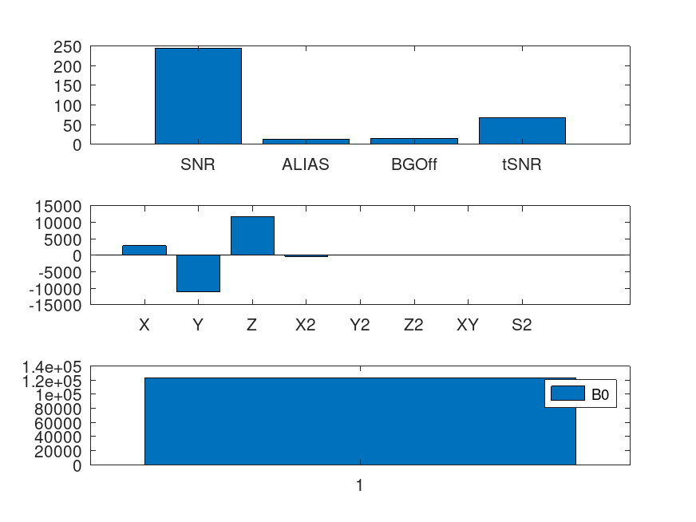

# MRRC Prisma Phantom QC

```shell
Program/QC.m input/QA_PRISMA3QA_20240809_180204_160000/EP2D_BOLD_P2_S2_5MIN_0003/ outputs/

jq .snrpk < outputs/stats.json # 242.8687622000182
ls outputs/bars.png
```



## TODO

 [ ] finish reconfiguring manifest to use dicom instead of nifti, rerun `fw-beta gear config` for `oconfig.json` fix
 [ ] break up `Program/dostat.m` and add tests using `input/trunc`

## Testing

```
make test
make test-docker
```

Using octave `%!test` in-file tests. See bottom of [Program/readshimvalues.m](Program/readshimvalues.m).


## Interfacing with Flywheel
 * repo init with copy from https://gitlab.com/flywheel-io/scientific-solutions/tutorials/Gear-Building-Tutorial/-/tree/hello-world

 * for `nifti` as file type in `manifest.json`, see https://docs.flywheel.io/User_Guides/user_file_types_in_flywheel/


## Phantom


