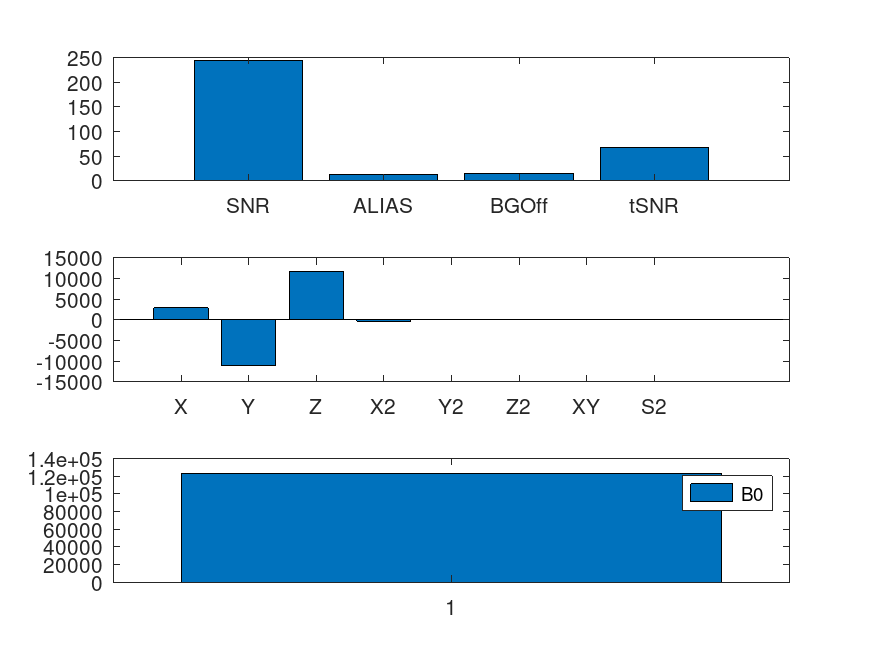
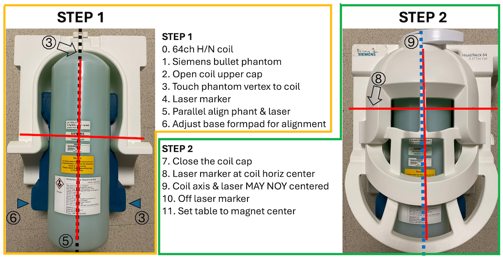
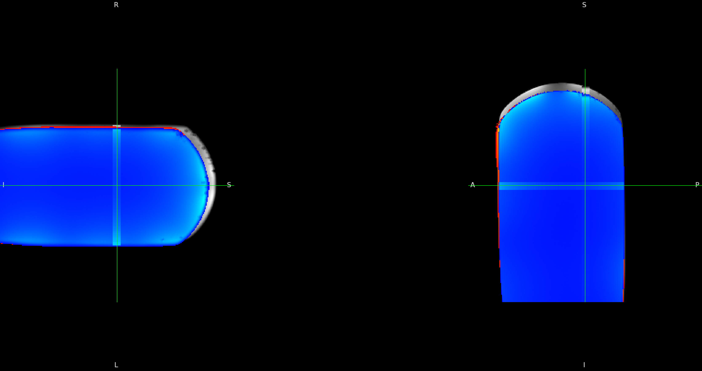

# MRRC Prisma Phantom QC

Build `stats.json` w/ peak values in background, phase encoding, and alias noise masks. Also runs SNR and tSNR within the phantom-containing voxels.

[`helpers/plots.R`](helpers/plots.R) uses the flywheel DB to create a csv and plot 
MRRC Prisma 1 to Prisma 3 outputs on https://wiki.mrrc.pitt.edu/doku.php?id=data:qc.

Some care was taken to work on Flywheel but not depend on it.
`manifest.json` details the flywheel configuration.

Other QC includes:
  * Total coil FWHM in [`FID/`](FID/) can be run as a flywheel file-curator gear (`FID/fwhm.py`) or as a stand alone script.
  * z-shim value alerting is handled by [`shim_notify.py`](https://github.com/NPACore/file-curator/blob/mrrc/examples/shim_notify.py) in the NPAC fork of [`file-curator`](https://github.com/NPACore/file-curator/)'s examples

## Matlab
An MRC ("compiled", no license required) container exists (20260221).

See `make test-docker-mlpy` for smoke test, building, and running (second test) the container.

```
docker run --rm \
  -v $PWD/input:/input:ro \
  -v /tmp/out:/out  \
  npac/mrrcqa-ml:1.5.1.20260105 \
    input/QA_PRISMA3QA_20240809_180204_160000/EP2D_BOLD_P2_S2_5MIN_0003/ 0 /out/
```

### Interactive with flywheel
See `run-fwid.py` with flywheel session id from web UI. Will run maltab code in temporary directory.

### Dockerfile
`Dockerfile.matlab-python` uses the container created by maltab (R2024+) in `mlbin/build_mrc_container.m` to add flywheel specific `run.py` and it's dependencies. But `entrypoint` remains the matlab `dostat` program.

## Octave
```shell
Program/QC.m input/QA_PRISMA3QA_20240809_180204_160000/EP2D_BOLD_P2_S2_5MIN_0003/ outputs/

jq .snrpk < outputs/stats.json # 242.8687622000182
ls outputs/bars.png
```




### TODO

  * break up `Program/dostat.m` and add tests using `input/trunc`
    * optimize/vectorize esp. `std` command? It's surprisingly slow
    * profile against matlab runtime - switch to ML compiled version if octave is much slow
  * slim docker container: build octave without Xorg or java (likely to be useful for other containers later)

## Testing

For Octave (slower) version of the pipeline
```
make test
make test-docker
```

Using octave `%!test` in-file tests. See bottom of [Program/readshimvalues.m](Program/readshimvalues.m).

## Editing

 * `Makefile` guides through steps
   * see `.docker` then `.gear` for packaging
   * mess of other files for `.gear-run.txt` with various input files setup (download input zip and setup `config.json`)
      * [`fw-beta`](https://flywheel-io.gitlab.io/tools/app/cli/fw-beta/) is used for gear setup
      * this started from [hello-world gear](https://gitlab.com/flywheel-io/scientific-solutions/tutorials/Gear-Building-Tutorial/-/tree/hello-world)
      * `Program/run.py` still used for flywheel entry (sets up `input/` and `output`, eventually handles DB)

 * bump version in [`manifest.json`](manifest.json): `"version":` and `"custom": { "gear-builder": { "image": "npac/mrrcqa:1.0.20240822" } }`  current match.


### Noteworth files

|file|desc|
|--|--|
|[`Program/QC.m`](Program/QC.m) | octave script, docker entrypoint into `@chm`s matlab QC code|
|[`Program/run.py`](Program/run.py) | flywheel-aware entrypoint for gear. unzips and dispatches to QC.m |
|[`Makefile`](Makefile) | `make` interface to building and testing recipes |
|[`Dockerfile`](Dockerfile) | describes software dependencies, recipe for container |
|[`config.json`](config.json) | `fw-beta gear run` input. built with Makefile |

## Interfacing with Flywheel
 * repo init with copy from https://gitlab.com/flywheel-io/scientific-solutions/tutorials/Gear-Building-Tutorial/-/tree/hello-world

 * for `archive` as file type in `manifest.json`, see https://docs.flywheel.io/User_Guides/user_file_types_in_flywheel/ (c.f `nifti`)
 * clasification `qa` picked form list on https://flywheel-io.gitlab.io/tools/app/cli/fw-beta/gear/upload/


## Phantom





## Uploading
as in Makefile, the final upload uses `fw-beta gear upload .`. But the F5 managed firewall might block requests. And flywheel will error if using podman instead of docker.
>  Error: writing blob: determining upload URL: http: no Location header in response

### Flywheel bug
v20.1 (2024-03) cannot receive `docker push`, `fw gear upload` is broken until v20.2


### Podman vs Docker
`fw-beta gear install` wont work with podman and docker is rate limited. But can copy from podman to docker using save/load.

via [SO](https://stackoverflow.com/questions/23935141/how-to-copy-docker-images-from-one-host-to-another-without-using-a-repository), can `docker load`
```
docker save localhost/npac/mrrcqa:1.1.20250312.01 | bzip2 | pv | ssh r docker load
```
### Load/Push to avoid firewall

We can use VM on the same host as fw-core (hosting docker registry) to work around enterprise firewall blocking `gear upload`/`docker push`

```
image=fw.mrrc.upmc.edu/mrrcqa:1.5.2.20260221
docker save $image | pv | ssh -J z fw-analysis docker load
# ssh -J z fw-analysis docker push $image  # push alone not sufficent?
ssh z virsh console docker-test
#   docker load -i $image_path
#   docker push $image
#   cd fw-mrcqa
#   # update tag to match manifest input
#   docker image tag fw.mrrc.upmc.edu/mrrcqa:1.5.2.20260221 npac/mrrcqa-ml:1.5.2.20260221
#   ~/.fw/fw-beta gear upload
```

see `flatten-docker.sh` for removing layers and transferring. Needed to resolve unsupported NFS `/var/lib/docker` mount on testing VM with xattr on files (from matlab base image).

### mitmproxy: debug firewall
```
SSLKEYLOGFILE="/tmp/ssl.log" mitmproxy
# trust anchor --store mitmproxy.crt # crt from http://mitm.it/
HTTPS_PROXY=http://localhost:8080 docker push fw.mrrc.upmc.edu/mrrcqa:1.1.20250312.01
```
